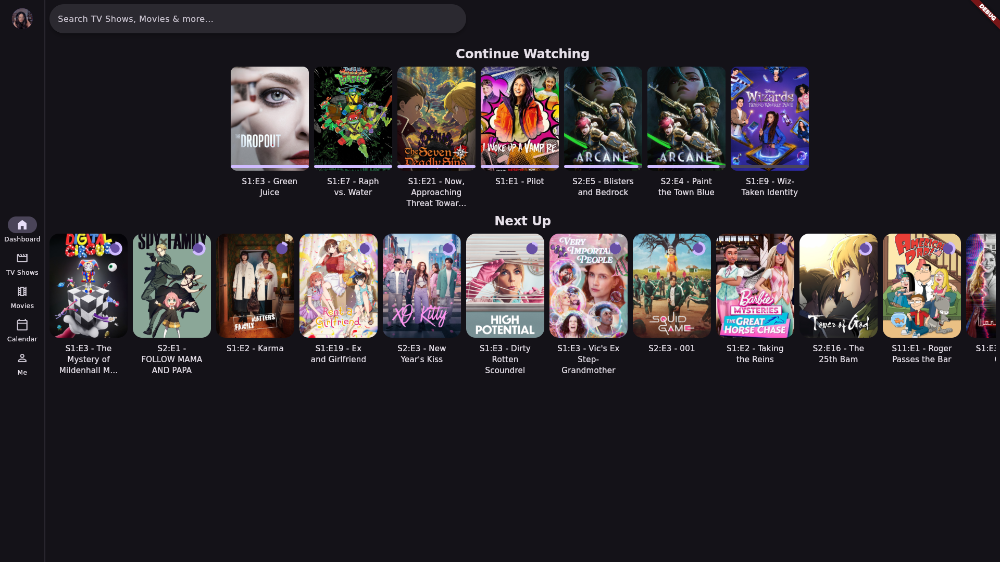
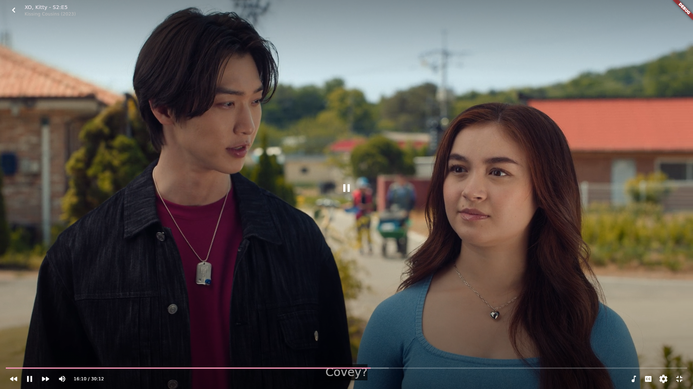
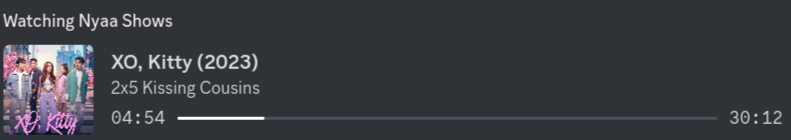
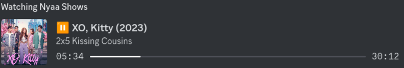

# NyaaShows

Video Player which searches common torrent-sites for series and movies utilizing debrid services.

Built using Flutter. (Windows, Linux, and MacOS)

More Screenshots

## Components

### Discord
Discord Rich Presence which shows what you're currently watching.

### Debrid Services
- [Real-Debrid](https://real-debrid.com/)

### Show APIs
- [TMDB](https://www.themoviedb.org/?language=en-US)
- [Trakt](https://trakt.tv)
- [TVDB](https://www.thetvdb.com/)

### Torrent Providers
- [TorrentGalaxy](https://torrentgalaxy.one)
- [ThePirateBay](https://1.piratebays.to)

## Dependencies
- [Cupertino Icons](https://pub.dev/packages/cupertino_icons)
- [http](https://pub.dev/packages/http)
- [url_launcher](https://pub.dev/packages/url_launcher)
- [path_provider](https://pub.dev/packages/path_provider)
- [Html Parser](https://pub.dev/packages/html_parser_plus)
- [html](https://pub.dev/packages/html)
- [video_player_media_kit](https://pub.dev/packages/video_player_media_kit)
- [flutter_rust_bridge](https://pub.dev/packages/flutter_rust_bridge)
- [flutter_discord_rpc](https://pub.dev/packages/flutter_discord_rpc)
- [flutter_svg](https://pub.dev/packages/flutter_svg)